# Hogwarts Adventure

Hogwarts Adventure is a text adventure game build with python that runs in the Code Institute mock terminal on Heroku. 
The user will be sent on a mission to find the Philosopher's stone and with their own input they will determine their game path.

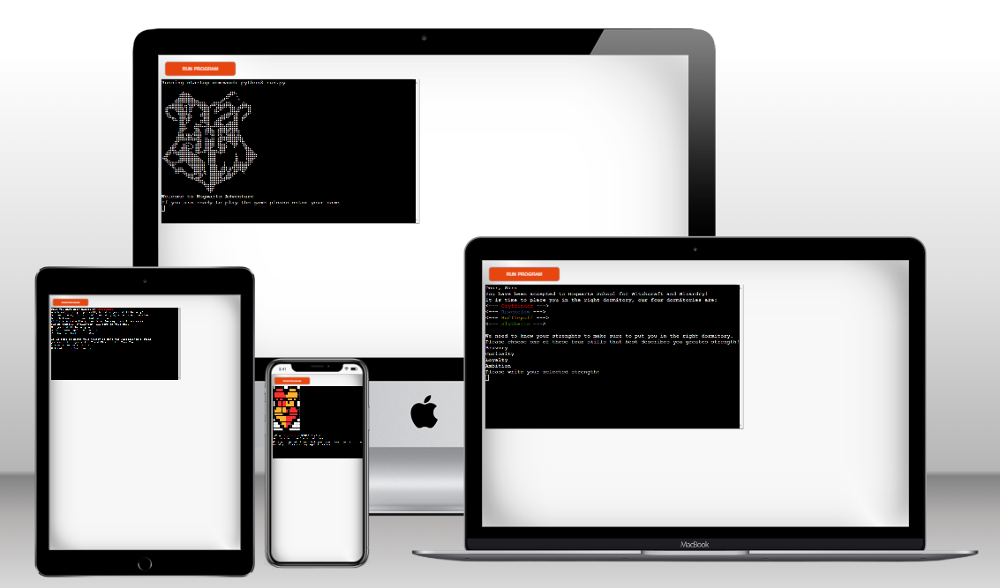

[Here can you visit Hogwarts Adventure](https://hogwarts-adventure-9b2d26ffdabb.herokuapp.com/)

## Game Instructions
Hogwarts Adventure is a text based python game based on the Harry Potter books from JK Rowling.
The game will start when the user implements their name and a welcome text with game instructions will be displayed.
Based on the user's input they will be assigned a dormitory and the user will be sent on a mission to find the Philosopher's stone and they have to tackle challenges along the way. The user will be asked to implement one of two options for each challenge that will lead them to the next challenge.
Each challenge will have a short story and a description of what the user have to do.

### Site Goals
* To provide a fun and interesting game that suits a wide range of ages

### Taget Audience
* Users that enjoy adventure games
* Harry Potter fans

### User Stories
* As I user would I like the game to be easy to understand with clear description provided
* I like that the challenges are based on "true stories" from the actual Harry Potter books
* After the game is won or lost I got the opportunity to decide if I want to play again or no.

## Structure

### Flowchart

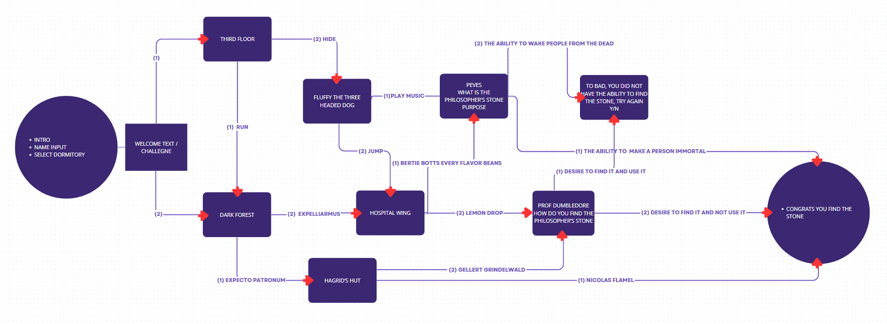

### Features
#### Existing Features
* Introduction
* 8 different challenges 
* Finish text for win and lose
* Opportunity to play again

#### Input
* User input 
  * for Name to make it more personal - User is not limited when implementing their name
  * for Strength to assign user in dormitory
  * for Deciding game path

* Input validation
  * Dormitory
    * User have to implement by writing one of the four strenghts that is displayed to be assign a dormitory
  * Challenge path
    * User must implement 1 or 2 to move on to the next challenge

#### Future Features
* Add more challenges
  * Collect points
* Users can play togheter
  * In the same dormitory
  * Against each other

#### Game in action

Here is a comparison of the game for two different users with different inputs.

##### User Jane

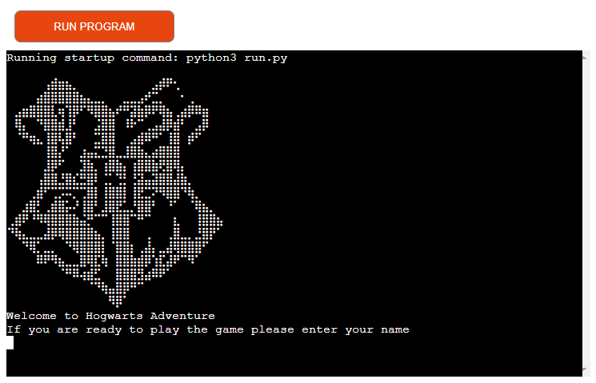

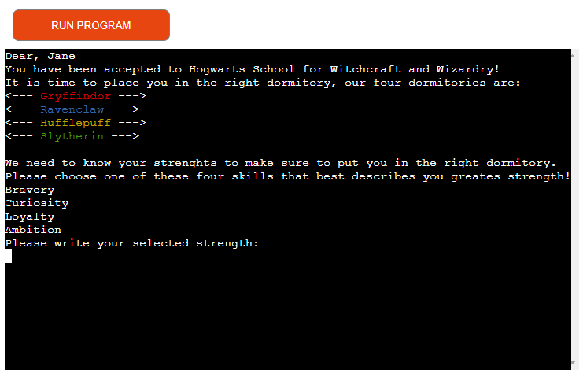

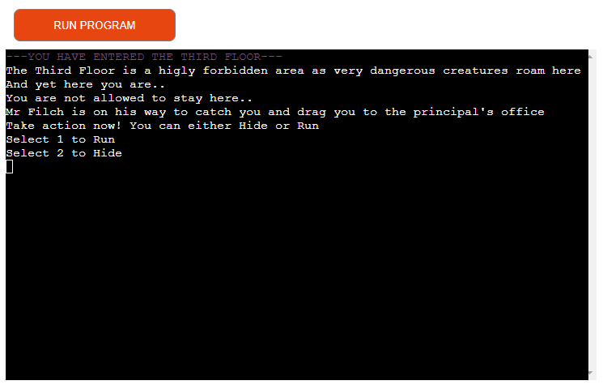

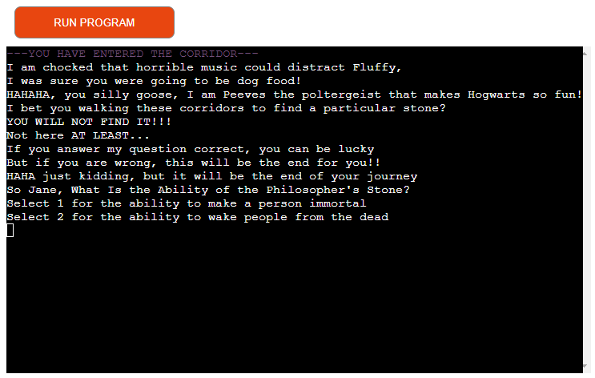

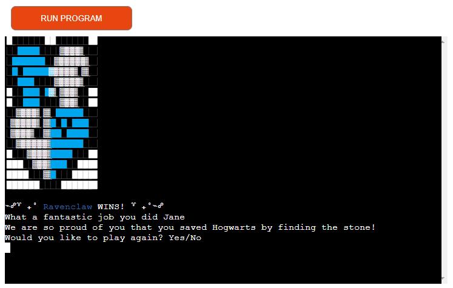

##### User John

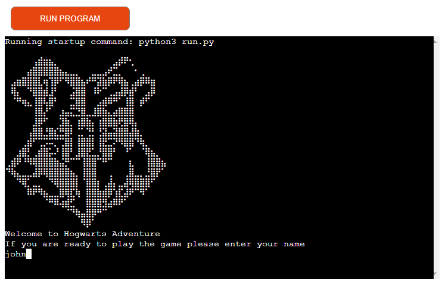

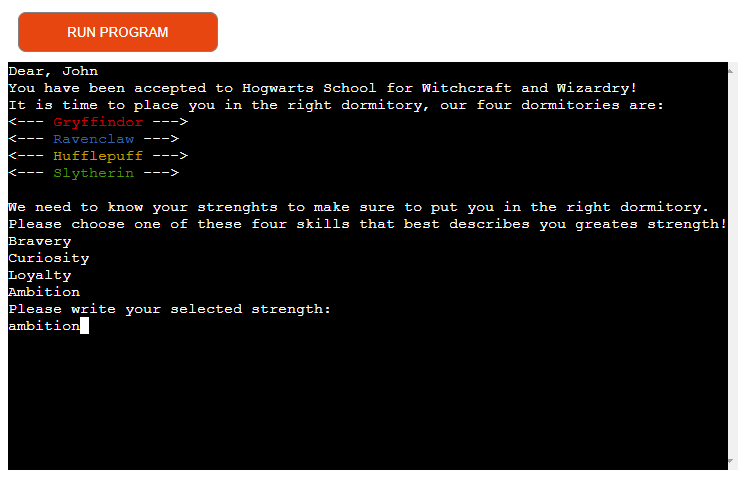

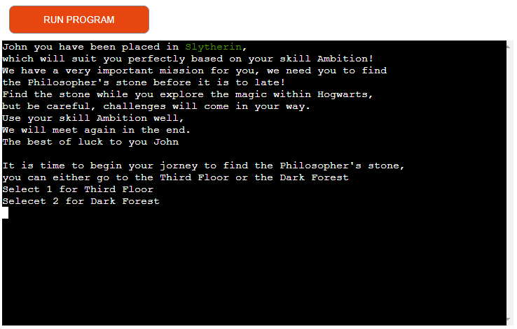

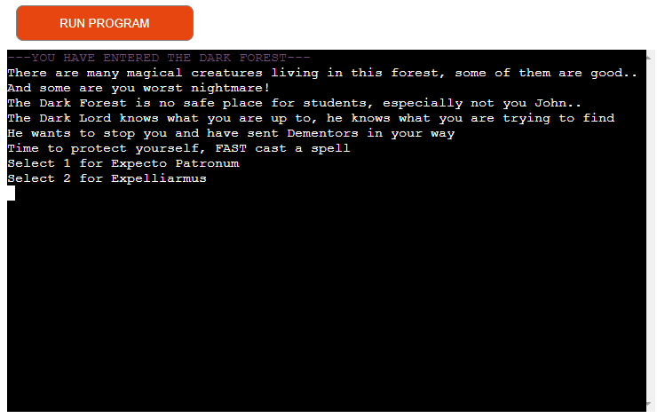

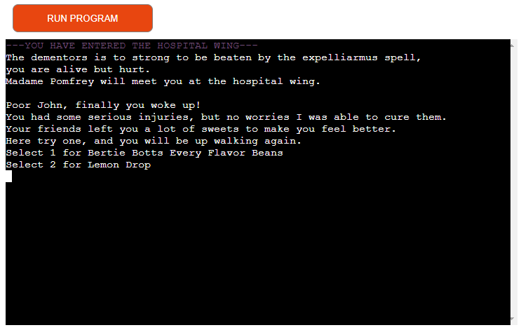

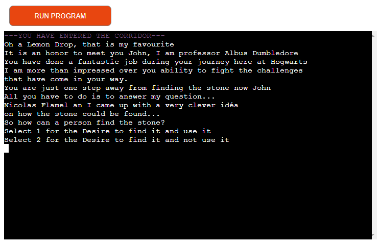

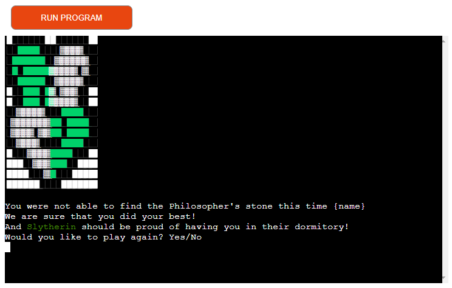

