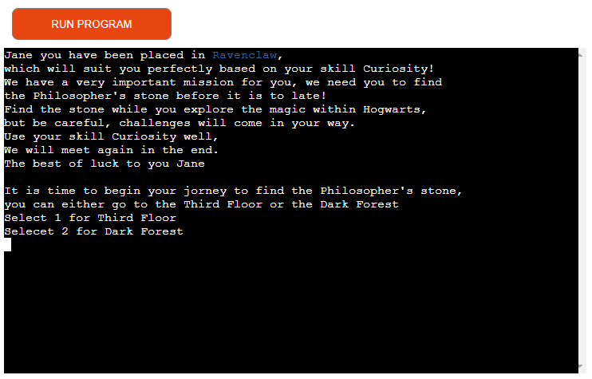
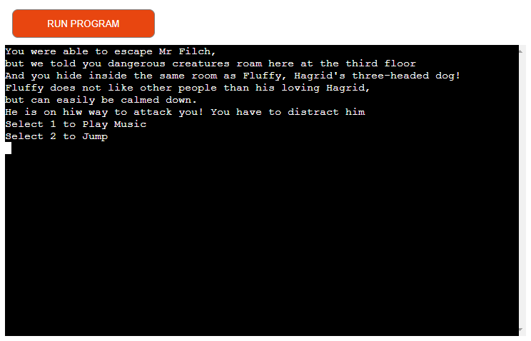

# Hogwarts Adventure

Hogwarts Adventure is a text adventure game build with python that runs in the Code Institute mock terminal on Heroku. 
The user will be sent on a mission to find the Philosopher's stone and with their own input they will determine their game path.

[Here can you visit Hogwarts Adventure](https://hogwarts-adventure-9b2d26ffdabb.herokuapp.com/)

## Game Instructions
Hogwarts Adventure is a text based python game based on the Harry Potter books from JK Rowling.
The game will start when the user implements their name and a welcome text with game instructions will be displayed.
Based on the user's input they will be assigned a dormitory and the user will be sent on a mission to find the Philosopher's stone and they have to tackle challenges along the way. The user will be asked to implement one of two options for each challenge that will lead them to the next challenge.
Each challenge will have a short story and a description of what the user have to do.

### Site Goals
* To provide a fun and interesting game that suits a wide range of ages

### Taget Audience
* Users that enjoy adventure games
* Harry Potter fans

### User Stories
* As I user would I like the game to be easy to understand with clear description provided
* I like that the challenges are based on "true stories" from the actual Harry Potter books
* After the game is won or lost I got the opportunity to decide if I want to play again or no.

## Structure

### Flowchart

### Features
#### Existing Features
* Introduction
* 8 different challenges 
* Finish text for win and lose
* Opportunity to play again

#### Input
* User input 
  * for Name to make it more personal - User is not limited when implementing their name
  * for Strength to assign user in dormitory
  * for Deciding game path

* Input validation
  * Dormitory
    * User have to implement by writing one of the four strenghts that is displayed to be assign a dormitory
  * Challenge path
    * User must implement 1 or 2 to move on to the next challenge

#### Future Features
* Add more challenges
  * Collect points
* Users can play togheter
  * In the same dormitory
  * Against each other

#### Game in action

Here is a comparison of the game for two different users with different inputs.

 **User Jane**

- The user will start with entering their name
- The user is not limited by the input, they can choose letters numbers or symbols

- The name input will be automatically capitalized to look good in the text
- The user will be asked to select their strength by writing on of the options

- Depending of the selected strength the dormitory will be displayed in its own color
- In Jane's case Ravenclaw = blue (Curiosity is the stregth for Ravenclaw)
- Jane will be provided with the challenge description

- Challenge description for the Third Floor that Jane chosed by input 1 in the previous challenge

- Challenge description for running into Fluffy when Jane used 2 for input in the previous challenge

- Challenge description for entering the corridor and met Peeves the poltergaist when Jane input 1 in the previous challenge

- Jane won the game by answering correct to Peeves question in the previous challenge
- As Jane was assign to Ravenclaw, that dormitorys shield will be displayed with congratulations text
- Jane will be offered the opportunity to play again

**User John**

- The user will start with entering their name
- The user is not limited by the input, they can choose letters numbers or symbols

- The name input will be automatically capitalized to look good in the text
- The user will be asked to select their strength by writing on of the options

- Depending of the selected strength the dormitory will be displayed in its own color
- In John's case Slytherin = green (Ambition is the stregth for Slytherin)
- John will be provided with the challenge description

- Challenge description for the Dark Forest that John chosed by input 2 in the previous challenge

- Challenge description for the Hospital wing that John chosed by input 2 in the previous challenge

- Challenge description for entering the corridor and met Proffessor Dumbledore when John input 2 in the previous challenge

- John lost the game by answering wrong to Dumbledores question in the previous challenge
- As John was assign to Slytherin, that dormitorys shield will be displayed with a "good job, but you lost" text
- John will be offered the opportunity to play again

##### Additional Information
* The user will have the opportunity to be assign to one of four dormitories
* Each dormitory has their own strength, color and shield that will be displayed in different steps thorugh the game
* There is five different paths that will lead to a win for the user

## Technologies
* Python - The main language to build the game application
  * Python packages
    * Colorama - To implement color
* Gitpod
  * IDE used to develope code
* Git
  * Used to push and commit code
* Github
  * To source code
* Heroku
  * To deploy
* Canva 
  * To build flowchart

## Testing

## Deployment

## Credits

* Code Institute for the deployment Terminal
* My mentor for guidence and advice
* My partner and family who tried the game as it was under development
* The writer JK Rowling that inspired me with her Harry Potter story

### Code
* https://emojicombos.com/harry-potter-ascii-art
  * The ascii art was borrowed from this site

* https://www.makeuseof.com/python-text-adventure-game-create/
  * The function structure was borrowed from this site

* https://www.101computing.net/python-typing-text-effect/
  * Insperation for time sleep and to clear screen after each challenge was borrowed from this site

